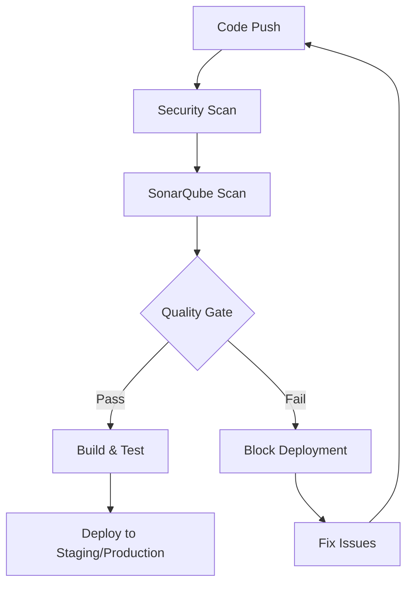

# SonarQube Integration Guide

This guide provides comprehensive instructions for integrating SonarQube into your DevSecOps pipeline.

## 🎯 Overview

SonarQube has been integrated into the DevSecOps project to provide:
- **Code Quality Analysis**: Automated code quality checks
- **Security Vulnerability Detection**: Static security analysis
- **Code Coverage Reporting**: Test coverage metrics
- **Quality Gates**: Automated quality enforcement
- **PR Decoration**: Quality feedback in pull requests

## 🏗️ Architecture

```
┌─────────────────┐    ┌─────────────────┐    ┌─────────────────┐
│   GitHub Repo   │───▶│  GitHub Actions │───▶│   SonarQube     │
│                 │    │   CI/CD Pipeline│    │     Server      │
└─────────────────┘    └─────────────────┘    └─────────────────┘
                                │
                                ▼
                       ┌─────────────────┐
                       │ Quality Gates   │
                       │ & PR Decoration │
                       └─────────────────┘
```

## 📋 Prerequisites

- Kubernetes cluster (AKS)
- kubectl configured
- GitHub repository with Actions enabled
- SonarQube server deployed

## 🚀 Quick Start

### 1. Deploy SonarQube Server

```bash
# For Linux/Mac
./scripts/setup-sonarqube.sh

# For Windows PowerShell
.\scripts\setup-sonarqube.ps1
```

### 2. Access SonarQube

```bash
# Port forward to access SonarQube
kubectl port-forward service/sonarqube 9000:9000 -n sonarqube
```

Open: http://localhost:9000

**Default credentials**: admin/admin

### 3. Configure GitHub Secrets

Add these secrets to your GitHub repository:

1. **SONAR_TOKEN**: Generate in SonarQube
   - Go to Administration > Security > Users > Tokens
   - Create a new token named "github-actions"
   - Copy the token value

2. **SONAR_HOST_URL**: SonarQube server URL
   - Value: `http://localhost:9000` (or your server URL)

### 4. Create Projects in SonarQube

Create projects for each service:
- `customer-service`
- `order-service`
- `product-service`
- `frontend`

## 🔧 Configuration Details

### SonarQube Server Configuration

The SonarQube server is configured with:

```yaml
# k8s/sonarqube.yaml
- PostgreSQL database
- Persistent storage for data, logs, and extensions
- LoadBalancer service for external access
- Health checks and resource limits
- Quality gate enforcement
```

### Project Configuration

Each service has its own `sonar-project.properties`:

```properties
# Example: backend/customer_service/sonar-project.properties
sonar.projectKey=customer-service
sonar.projectName=Customer Service
sonar.projectVersion=1.0
sonar.sources=app
sonar.tests=tests
sonar.python.coverage.reportPaths=coverage.xml
sonar.python.xunit.reportPath=test-results.xml
sonar.exclusions=**/__pycache__/**,**/migrations/**,**/venv/**,**/env/**
sonar.python.version=3.9
sonar.qualitygate.wait=true
```

### CI/CD Pipeline Integration

The GitHub Actions pipeline includes a dedicated SonarQube scan job:

```yaml
# .github/workflows/ci-cd-pipeline.yml
sonarqube-scan:
  runs-on: ubuntu-latest
  needs: security-scan
  strategy:
    matrix:
      service: [customer_service, order_service, product_service, frontend]
  steps:
    - name: SonarQube Scan
      uses: sonarqube-quality-gate-action@master
      with:
        args: >
          -Dsonar.projectKey=${{ matrix.service }}
          -Dsonar.host.url=${{ secrets.SONAR_HOST_URL }}
          -Dsonar.login=${{ secrets.SONAR_TOKEN }}
          -Dsonar.qualitygate.wait=true
```

## 📊 Quality Gates

### Default Quality Gate Configuration

The quality gate enforces:

| Metric | Threshold | Action |
|--------|-----------|--------|
| Code Coverage | ≥ 80% | Fail if below |
| Duplicated Lines | ≤ 3% | Fail if above |
| Maintainability Rating | ≤ 1 | Fail if above |
| Reliability Rating | ≤ 1 | Fail if above |
| Security Rating | ≤ 1 | Fail if above |
| Bugs | = 0 | Fail if any |
| Vulnerabilities | = 0 | Fail if any |
| Code Smells | ≤ 100 | Fail if above |

### Customizing Quality Gates

1. Access SonarQube web interface
2. Go to Quality Gates
3. Create or modify quality gates
4. Set thresholds for your requirements

## 🔍 Code Analysis Features

### Python Services Analysis

- **Code Coverage**: Test coverage reporting
- **Code Duplication**: Duplicate code detection
- **Code Smells**: Maintainability issues
- **Security**: Vulnerability detection
- **Reliability**: Bug detection
- **Maintainability**: Code complexity analysis

### Frontend Analysis

- **JavaScript**: Code quality analysis
- **Test Coverage**: Jest coverage reporting
- **Code Smells**: Maintainability issues
- **Security**: Vulnerability detection

## 🚦 Pipeline Flow



## 📈 Monitoring and Reporting

### SonarQube Dashboard

Access comprehensive reports at:
- **Project Overview**: High-level metrics
- **Code Quality**: Detailed analysis
- **Security**: Vulnerability reports
- **Coverage**: Test coverage details
- **Duplications**: Code duplication analysis

### GitHub Integration

- **PR Decoration**: Quality feedback in pull requests
- **Quality Gate Status**: Pass/fail indicators
- **Issue Tracking**: Link to SonarQube issues

## 🛠️ Troubleshooting

### Common Issues

1. **SonarQube Server Not Accessible**
   ```bash
   # Check pod status
   kubectl get pods -n sonarqube
   
   # Check service
   kubectl get svc -n sonarqube
   
   # Port forward if needed
   kubectl port-forward service/sonarqube 9000:9000 -n sonarqube
   ```

2. **Quality Gate Failures**
   - Check code coverage: ensure tests cover at least 80%
   - Fix code smells and security vulnerabilities
   - Reduce code duplication to below 3%
   - Address maintainability, reliability, and security issues

3. **Authentication Issues**
   - Verify SONAR_TOKEN is correct
   - Check SONAR_HOST_URL is accessible
   - Ensure token has proper permissions

4. **Coverage Reports Not Generated**
   - Install coverage tools: `pip install coverage pytest-cov`
   - Run tests with coverage: `coverage run -m pytest`
   - Generate XML report: `coverage xml`

### Debug Commands

```bash
# Check SonarQube logs
kubectl logs -f deployment/sonarqube -n sonarqube

# Check database connection
kubectl logs -f deployment/sonarqube-db -n sonarqube

# Verify quality gate configuration
curl -u admin:admin http://localhost:9000/api/qualitygates/list

# Check project status
curl -u admin:admin http://localhost:9000/api/projects/search
```

## 🔐 Security Considerations

### Token Management

- Use dedicated tokens for CI/CD
- Rotate tokens regularly
- Store tokens securely in GitHub Secrets
- Use least privilege principle

### Network Security

- Use HTTPS in production
- Configure firewall rules
- Use private networks when possible
- Enable authentication

### Data Protection

- Encrypt sensitive data
- Regular backups
- Access control
- Audit logging

## 📚 Best Practices

### Code Quality

1. **Write Clean Code**
   - Follow coding standards
   - Use meaningful names
   - Keep functions small
   - Add comments where needed

2. **Test Coverage**
   - Aim for 80%+ coverage
   - Test edge cases
   - Use meaningful test names
   - Keep tests simple

3. **Security**
   - Fix vulnerabilities immediately
   - Use secure coding practices
   - Regular dependency updates
   - Security code reviews

### Pipeline Optimization

1. **Parallel Execution**
   - Run scans in parallel
   - Use matrix strategies
   - Optimize build times

2. **Caching**
   - Cache dependencies
   - Cache build artifacts
   - Use incremental builds

3. **Monitoring**
   - Track quality trends
   - Monitor build times
   - Alert on failures

## 🎯 Next Steps

1. **Customize Quality Gates**: Adjust thresholds for your needs
2. **Add More Languages**: Extend analysis to other languages
3. **Integrate with IDEs**: Use SonarLint for real-time feedback
4. **Set Up Alerts**: Configure notifications for quality issues
5. **Create Dashboards**: Build custom quality dashboards

## 📞 Support

For issues and questions:
- Check SonarQube documentation
- Review GitHub Actions logs
- Check Kubernetes pod logs
- Consult the troubleshooting section

---

**Happy Coding with Quality! 🚀**
